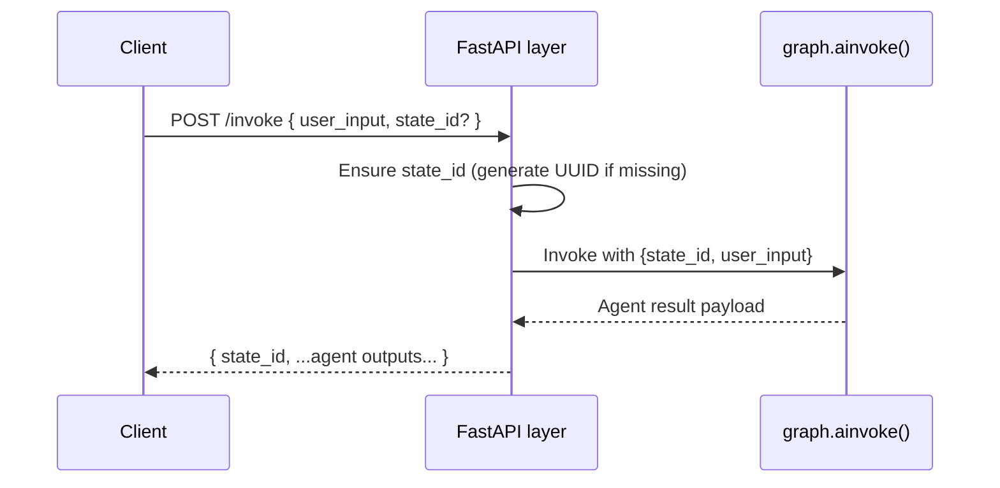

# Landy AI API

Base URL: `https://landy-ai.vercel.app`

## Endpoints

### 1. Health Check

- **Method & Path:** `GET /health`
- **Purpose:** Service liveness probe.
- **Response Body:**
  ```json
  {
    "status": "ok"
  }
  ```
- **Implementation:** [`health()`](src/index.py:16)

### 2. Invoke Orchestrator

- **Method & Path:** `POST /invoke`
- **Request Body:** [`InvokeRequest`](src/index.py:10)

  | Field        | Type   | Required | Description                                                                    |
  |--------------|--------|----------|--------------------------------------------------------------------------------|
  | `user_input` | string | yes      | Natural-language query executed by the agent graph.                            |
  | `state_id`   | string | no       | Optional conversation/session identifier. Auto-generated when omitted.         |

- **Behavior:**
  1. Missing `state_id` values are populated with a UUID from [`uuid4()`](src/index.py:2).
  2. The orchestrator is invoked via [`graph.ainvoke()`](src/index.py:29) with the `thread_id` set to the resolved `state_id`.

- **Success Response (200):**

  | Field      | Type   | Description                                                                 |
  |------------|--------|-----------------------------------------------------------------------------|
  | `state_id` | string | Echoes provided ID or generated UUID for client-side correlation.          |
  | `…`        | any    | Additional agent-specific payload produced by [`graph`](agent/orchestrator.py:15). |

## Sequence Overview



## Usage Tips

- Provide `state_id` to maintain multi-turn conversations; otherwise one is generated automatically.
- Expect the response payload to include agent-specific keys (for example, tool traces or structured answers) as defined by [`graph`](agent/orchestrator.py:15).
